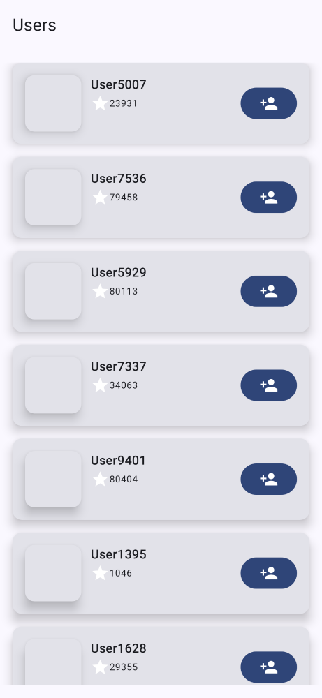
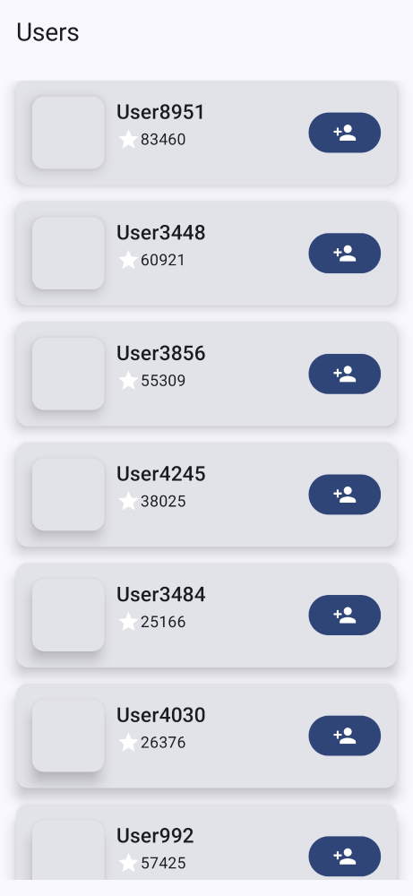
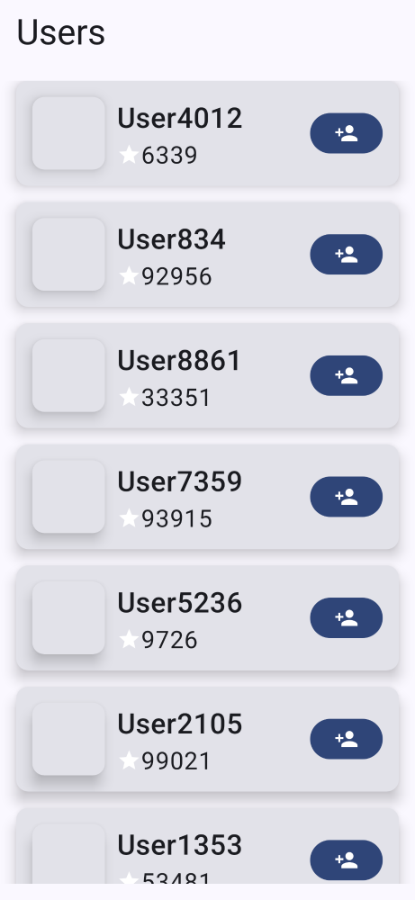
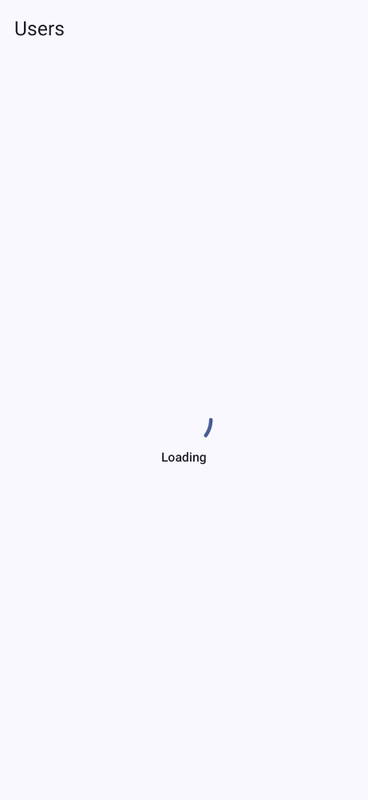
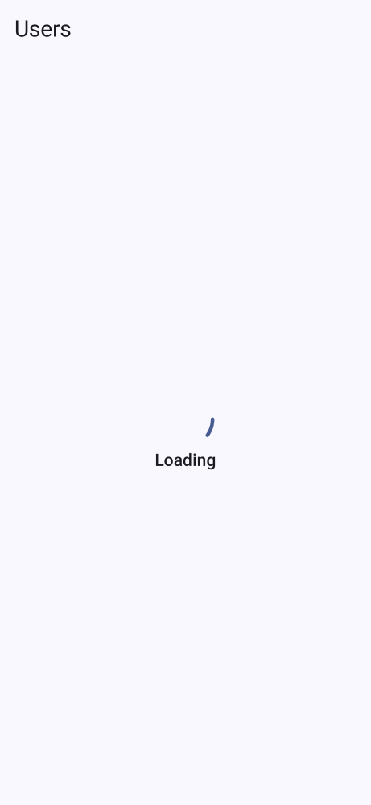
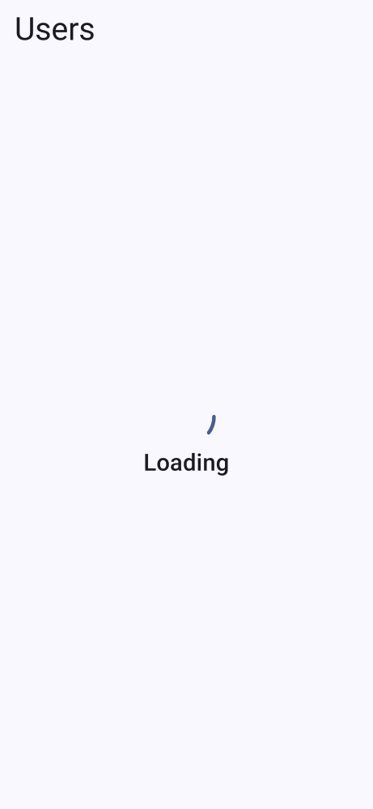
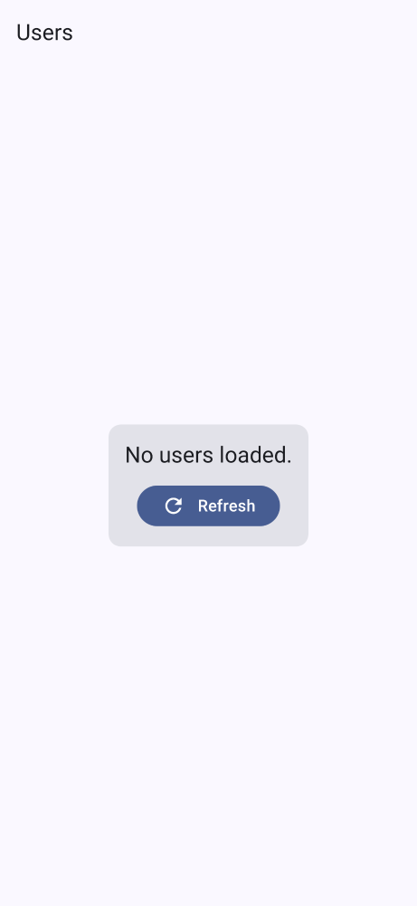
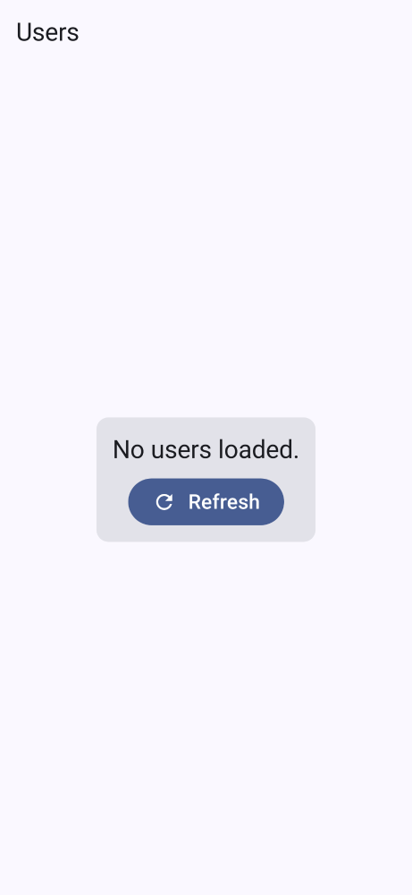
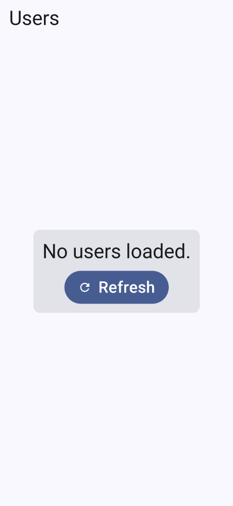

# StackOverflowViewer

## Technologies
- Modern MVVM structure using ViewModel/UseCase/StateFlow/SavedStateHandle
- Hilt for DI
- LocalData for local storage
- Navigation 2 for nav graph
- Retrofit/okhttp/moshi for network requests
- Robolectric + Mockk + Paparazzi for tests

- AGP 8.10.1
- Built using Android Studio 2024.3.2 - runs quickly on my machine!

## Decisions made

### App
- LocalData was used as Room felt like overkill for storing a list of followers
- Navigation 2 lib used as I've not used Nav 3 yet
- Hilt was used as it's quick and easy to get started with
- Retrofit - pretty standard though there's a debate about whether Ktor should be used going forward...
- MVVM - following standard practices, nothing too out of the ordinary going on here
- There's a usersAndFollows StateFlow which combines a users and follows StateFlow - this was used to fit the requirement for a separate Users and Follows data source 
- There is no Repository layer offline caching yet - Room would be best for that 
- SharedFlow used to emit errors and follow events
- SavedStateHandle is used for UI layer caching
- UI is super basic. Default colors have been used.
- I've tried to avoid hard coding anything UI related, most dimensions are in Theme.kt.

### Testing
- I've not added any UseCase tests as the UseCases are super simple at the moment
- Paparazzi was used for Snapshot testing - super easy to get running and very flexible
- Mockk for mocking - seems like the natural successor to Mockito, more kotlin idiomatic

## Future improvements
- Nicer UI. Add padding etc to CompositionLocal to integrate with MaterialTheme
- Add Room for proper repository level caching
- UI state could be made into its own class which includes an ErrorState - though this would make SavedStateHandle more complex
- Instrumentation tests 
- Snapshot tests could be greatly expanded
- Update to kotlin 2.3.x to take advantage of explicit backing fields

## Build artifacts
- Paparazzi report is at build/reports/paparazzi/debug/index.html

# Paparazzi screenshots

## User list - Normal text

## User list - Large text

## User list - Extra Large text

## User list - Loading - Normal text

## User list - Loading - Large text

## User list - Loading - Extra Large text

## User list - Empty list - Normal text

## User list - Empty list - Large text

## User list - Loading - Extra Large text

# Demo videos

## Loading users
[[Video - demo 1]](video/video-normal.mov)

## Empty list state + error message
[[Video - demo error]](video/video-error.mov)